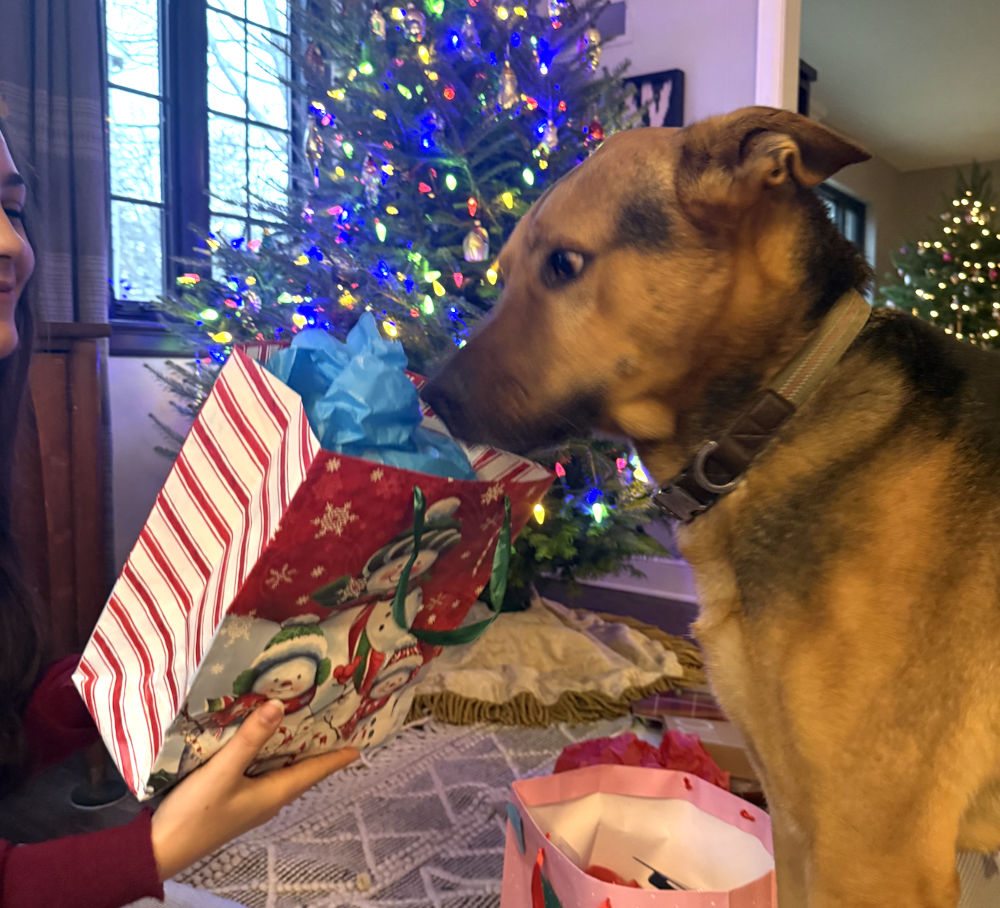

This page is where you can iterate. Follow the lab instructions in the [readme.md](./README.md).

# Della's Lab 0 Dashboard
## About Me
I love data visualization.

## My Dog Is Great!

<table>
<tr><th>Name</th><th>Dog</th></tr>
<tr><td>Milo</td><td>German Shepherd, Mutt</td></tr></table>

<ul>
<li>Loves me</li>
<li>Cute little fella</li>
<li>Jeep passenger prince</li>
</ul>

## How Cute Is Milo?

He's This Cute (Out of 10): 5

<input
  type="range"
  min="0"
  max="10"
  value="5"
  oninput="document.getElementById('sliderValue').textContent = this.value"
/>
